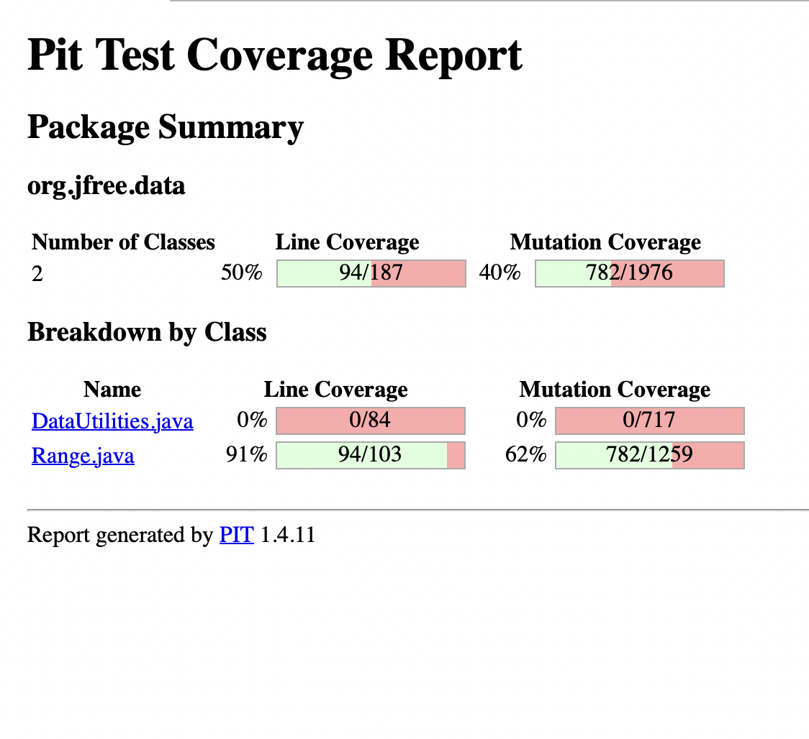

**SENG 438 - Software Testing, Reliability, and Quality**

**Lab. Report \#4 – Mutation Testing and Web app testing**

| Group \#:       |   |
|-----------------|---|
| Student Names:  | Lauraine Baffot  |
|                 | Alexis Hamrak  |
|                 | Abhay Kholsa  |
|                 | Rachel Renegado  |

# Introduction
Mutation testing and using Selenium tool was the main focus of this lab assignment as to familiarize ourselves with these concepts first seen in the lectures, for the mutation testing our group decided to use the PIT testing tool to see the mutation coverage in Eclipse. In the Part 2 of the lab we used the Selenium IDE extension on our respective browsers. Additionally, mutation testing was introduced to ensure that the original source code has a high error detection, with the test cases written to catch weak spots of the code which were not tested properly. GUI testing was another focal point in this lab assignment, is a bit of an insight to automating the test cases and primarily on the foundation of a user interface which the user can record/run their scripts. 

# Analysis of 10 Mutants of the Range class 

# Report all the statistics and the mutation score for each test class
## Original Test Scores
### Range Original Mutation Score (73%)

### DataUtilities Original Mutation Score (96%)

 
## Improved statistics
### Range Tests Added 
#### getCentralValuePositive()
- This test was created to test the method getCentralValue() found in the Range class. We create a Range object that has a range from 4 to 8 and used the method to find the central value of this range. We used an *assertEquals* to check if the method is returning the correct number, which should be 6. This method was not tested previously which is why this test was able to kill many mutants and increase the mutation score.
#### containsValueOnLowerBound()
- This test was created to check the lower boundary condition of the contains(double value) method in the Range class. We created a Range object that has a range from 2 to 6 and used the method to check if the value 2 is in this range. We used an *assertTrue* to check if the method is returning a true boolean because the range does contain the value 2 (which is also the lower bound of the range). This test was able to kill many mutants because the lower bound of the range was not being checked beforehand, which also increased the mutation score.
#### containsValueOnUpperBound()
- This test was created to check the upper boundary condition of the contains(double value) method in the Range class. We created a Range object that has a range from 2 to 6 and used the method to check if the value 6 is in this range. We used an *assertTrue* to check if the method is returning a true boolean because the range does contain the value 6 (which is also the upper bound of the range). This test was able to kill many mutants because the upper bound of the range was not being checked beforehand, which also increased the mutation score.
#### containsDecrement()
- 
#### intersectsLowerBoundRangeEqualsUpperBound()
- This test was created to check the upper boundary condition of the intersects(double b0, double b1) method in the Range class. We created a Range object that has a range from 2 to 6 and created a double value lowerBound = 1 and double value upperBound = 2 (which equals the lower bound of the Range object). Using these two double values, we checked if there were an intersection between our Range object and these values. We used an *assertFalse* to check if the method is returning a false boolean because there is no intersection between the Range object and these two values, even though the lower bound of the Range object equals the lowerBound value. This test was able to kill many mutants because the upper bound of the range was not being checked for intersection, which also increased the mutation score.
#### intersectsUpperBoundRangeEqualsLowerBound()
- This test was created to check the lower boundary condition of the intersects(double b0, double b1) method in the Range class. We created a Range object that has a range from 2 to 6 and created a double value lowerBound = 6 (which equals the upper bound of the Range object) and double value upperBound = 7. Using these two double values, we checked if there were an intersection between our Range object and these values. We used an *assertFalse* to check if the method is returning a false boolean because there is no intersection between the Range object and these two values, even though the upper bound of the Range object equals the uppererBound value. This test was able to kill many mutants because the lower bound of the range was not being checked for intersection, which also increased the mutation score.
#### intersectsBoundary()
- 
#### intersectsIncrement()
- 
#### intersectsDecrement()
- 
#### intersectsRangeIsFalse()
- This test was created to check the intersects(Range range) method in the Range class. We created a Range object that has a range from 2 to 6 and created another Range object with a range of 7 to 9. We used an *assertFalse* to check if the method is returning a false boolean because there is no intersection between the two Range objects and these two values. This test was able to kill many mutants because we did not previously check for two Range objects that do not intersect, which also increased the mutation score.
#### minAndMaxD2_NaN_LowerBound()
- This test was created to check the min(double d1, double d2) method in the Range class. This test will be testing the min function through the use of the combineIgnoringNaN function. We will be testing the lower bound of the result Range object, which was determined by using this method. We used an *assertEquals* to check if the method is indeed returning the minimum number between 1 and the square root of -1 (NaN). This test was able to kill some additional mutants because we did not previously test the lower bound of the result Range object, which also increased the mutation score.
#### scaleZeroFactor()
- This test was created to check the scale(Range base, double factor) method in the Range class. We created a Range object that has a range from 2 to 6 and called the method with a scaling factor of 0. We used an *assertEquals* to check if the lower bound of the Range object returns the value 0. This test was able to kill some additional mutants because we did not previously test the method when the scaling factor equals zero, which also increased the mutation score.
#### scalePositiveFactor()
-  This test was created to check the scale(Range base, double factor) method in the Range class. We created a Range object that has a range from 2 to 6 and called the method with a scaling factor of 2. We used an *assertEquals* to check if the lower bound of the Range object returns the correct value of 4. This test was able to kill some additional mutants because we did not previously test the method with a positive scaling factor, which also increased the mutation score.
#### shiftWithNoZeroCrossingWhereValueEqualsZero() 
- The test was created to check the shiftWithNoZeroCrossing(double value, double delta) method in the Range class. We created a Range object that has a range from 0 to 0 and called to method shift(Range base, double delta, boolean allowZeroCrossing) which then called the helper method shiftWithNoZeroCrossing(double value, double delta) since the parameter allowZeroCrossing is false. We used an *assertEquals* to check if the upper bound of the Range object returns the correct value after it was shifted by 158. This test was able to kill some additional mutants because we did not previously test the method when the upper bound of the Range object is 0, which also increased the mutation score.
#### shiftWithNoZeroCrossingWhereValueIsNegative()
- The test was created to check the shiftWithNoZeroCrossing(double value, double delta) method in the Range class. We created a Range object that has a range from -2 to -1 and called to method shift(Range base, double delta, boolean allowZeroCrossing) which then called the helper method shiftWithNoZeroCrossing(double value, double delta) since the parameter allowZeroCrossing is false. We used an *assertEquals* to check if the upper bound of the Range object returns the correct value after it was shifted by -158. This test was able to kill some additional mutants because we did not previously test the method when the upper bound of the Range object and the shifting factor are both negative values, which also increased the mutation score.
#### equalsParameterIsNotARangeObject() 
- The test was created to check the equals(Object obj) method in the Range class. We created a Range object that has a range from 2 to 6. We used an *assertFalse* to check if the Range object equals a null object, which it should not. This test was able to kill some additional mutants because we did not previously test the method with a null object, which also increased the mutation score. 
#### equalsDifferentLowerBound()
- The test was created to check the equals(Object obj) method in the Range class. We created a Range object that has a range from 2 to 6. We used an *assertFalse* to check if the Range object equals another Range object that has a range from 3 to 6, which it should not since the lower bounds for both Range objects are different. This test was able to kill some additional mutants because we did not previously test the method with two Range objects where the lower bounds are different, which also increased the mutation score. 
#### equalsDifferentUpperBound() 
- The test was created to check the equals(Object obj) method in the Range class. We created a Range object that has a range from 2 to 6. We used an *assertFalse* to check if the Range object equals another Range object that has a range from 2 to 5, which it should not since the upper bounds for both Range objects are different. This test was able to kill some additional mutants because we did not previously test the method with two Range objects where the upper bounds are different, which also increased the mutation score. 
#### hashCodeTest()
- The test was created to check the hashCode() method in the Range class. We created a Range object that has a range from 2 to 6. We used an *assertEquals* to check if the Range object’s hashcode is correct. This test was able to kill some additional mutants because we did not previously test the hashCode() method at all, which means there was no coverage for this method and increased the mutation score. 
#### toStringTest()
- The test was created to check the toString() method in the Range class. We created a Range object that has a range from 2 to 6. We used an *assertEquals* to check if the string returned is “Range[2.0,6.0]”. This test was able to kill some additional mutants because we did not previously test the toString() method at all, which means there was no coverage for this method and increased the mutation score.
#### constrainDecrement()
- 
 
### DataUtilities Tests Added
#### calculateColumnTotalRowGreaterRowTotal()
- This test created in our lab assignment four was to mainly check on the boundary condition of the DataUtilities.java in which the method calculateColumnTotal has the condition of row < rowCount in which it requires a rowCount greater than the valid rows which are being passed into the method. In the previous lab, we did not account for this case hence this new test case is specifically aimed at adding to our overall mutation coverage results for this class. The test case delivers this by having row being greater with a value of 4 and the rowCount only being 1 this is done with the help of using Mocking framework JMock in which this mock object is created with the specific properties.  
#### calculateColumnTotalRowEqualRowTotal()
- This mutant survived our original source code hence we were able to kill this mutant with our test case which again builds on the foundation of the JMock and created a mock object instead this time we were testing for the boundary condition of making the row and rowCount equal to each other which the method does not account for and the running total of the column becomes zero since this condition does not have a specific path to be taken. This conditional checking of this equality ensured that this mutant was killed by our test case generated.  
#### calculateColumnTotalNEqualNull() 
- For this test case we were testing a different part of the method which was using JMock framework and using a mock object with the statement of if n != null this mutant had survived in our original test suite which did not account for this, hence prompting us to create a test for increasing our overall mutation coverage. This test passed a null value as n which made that row disregard this value when calculating the total sum of the values in that column which is specified. 
#### calculateRowTotalChangedConditional()
- To kill the mutation on line 164 of DataUtilities.java titled “changed conditional boundary,” that had survived the original test suite, we developed this test to test the boundary for the condition “if (col < colCount)”. To do this, we created a mock object of Values2D with the value 1 returning when getColumnCount() is called. We passed the value 1 to the validRows parameter. In the calculateRowTotal function, colCount and col both gets the value 1 - covering the boundary condition and thus killing the mutant. 

# Analysis drawn on the effectiveness of each of the test classes
After adding the additional test cases to each test class (detailed in the above section), the effectiveness of each class was improved as follows:
 
### Range Class
#### Range New Mutation Score With Tests (91%)

Comparing our mutation scores from original test set (from Assignment 3) to our updated mutation scores (with our new test cases), we can see an increase of 18% - exceeding the required 10% increase as described in the lab manual. At a mutation test score of 91%, our test set is relatively strong and acceptable to clarify the reliability of the software program. There are a total of 28 mutants that survived.
 
### DataUtilities Class
#### DataUtilities New Mutation Score With Tests (99%)

Comparing our mutation scores from original test set (from Assignment 3) to our updated mutation scores (with our new test cases), we can see an increase of 3%. While not accomplishing the 10% increase (as it was not possible to exceed 100%), our test set has an acceptable mutant score - deeming our test set to be a successful in detect software faults and therefore a strong test set. There are only two mutants that survived the mutation testing.

# A discussion on the effect of equivalent mutants on mutation score accuracy
As we learned in class, a mutant is said to be killed when it produces different outputs while running the same test case as the original program; otherwise, it has survived. The mutant score accuracy represents the fault revealing power - the higher the number of killed mutants, the higher is the test case power. In mutation testing, a phenomenon that has causes issues in mutation testing is caused by equivalent mutants. Since equivalent mutants have the same behavior as the original program, the test set does not actually kill the mutant. Due to this, the mutation score accuracy is inaccurate to the actual representation mutant score (representation of the total killed mutants over the total mutations). 

# A discussion of what could have been done to improve the mutation score of the test suites

# Why do we need mutation testing? Advantages and disadvantages of mutation testing

# Explain your SELENUIM test case design process

# Explain the use of assertions and checkpoints

# how did you test each functionaity with different test data

# Discuss advantages and disadvantages of Selenium vs. Sikulix

# How the team work/effort was divided and managed

# Difficulties encountered, challenges overcome, and lessons learned

# Comments/feedback on the lab itself
