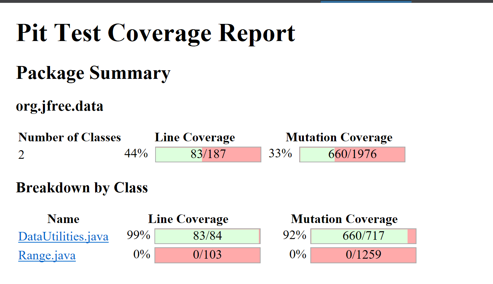

**SENG 438 - Software Testing, Reliability, and Quality**

**Lab. Report \#4 – Mutation Testing and Web app testing**

| Group \#:       |   |
|-----------------|---|
| Student Names:  | Lauraine Baffot  |
|                 | Alexis Hamrak  |
|                 | Abhay Kholsa  |
|                 | Rachel Renegado  |

# Introduction

# Analysis of 10 Mutants of the Range class 

# Report all the statistics and the mutation score for each test class
## Original Test Scores
### Range Original Mutation Score (73%)

### DataUtilities Original Mutation Score (96%)

 
## Improved statistics
### Range Tests Added -Lauraine
#### getCentralValuePositive()
- This test was created to test the method getCentralValue() found in the Range class. We create a Range object that has a range from 4 to 8 and used the method to find the central value of this range. We used an *assertEquals* to check if the method is returning the correct number, which should be 6. This method was not tested previously which is why this test was able to kill many mutants and increase the mutation score.
#### containsValueOnLowerBound()
- This test was created to check the lower boundary condition of the contains(double value) method in the Range class. We created a Range object that has a range from 2 to 6 and used the method to check if the value 2 is in this range. We used an *assertTrue* to check if the method is returning a true boolean because the range does contain the value 2 (which is also the lower bound of the range). This test was able to kill many mutants because the lower bound of the range was not being checked beforehand, which also increased the mutation score.
#### containsValueOnUpperBound()
- This test was created to check the upper boundary condition of the contains(double value) method in the Range class. We created a Range object that has a range from 2 to 6 and used the method to check if the value 6 is in this range. We used an *assertTrue* to check if the method is returning a true boolean because the range does contain the value 6 (which is also the upper bound of the range). This test was able to kill many mutants because the upper bound of the range was not being checked beforehand, which also increased the mutation score.
#### intersectsLowerBoundRangeEqualsUpperBound()
- This test was created to check the upper boundary condition of the intersects(double b0, double b1) method in the Range class. We created a Range object that has a range from 2 to 6 and created a double value lowerBound = 1 and double value upperBound = 2 (which equals the lower bound of the Range object). Using these two double values, we checked if there were an intersection between our Range object and these values. We used an *assertFalse* to check if the method is returning a false boolean because there is no intersection between the Range object and these two values, even though the lower bound of the Range object equals the lowerBound value. This test was able to kill many mutants because the upper bound of the range was not being checked for intersection, which also increased the mutation score.
#### intersectsUpperBoundRangeEqualsLowerBound()
- This test was created to check the lower boundary condition of the intersects(double b0, double b1) method in the Range class. We created a Range object that has a range from 2 to 6 and created a double value lowerBound = 6 (which equals the upper bound of the Range object) and double value upperBound = 7. Using these two double values, we checked if there were an intersection between our Range object and these values. We used an *assertFalse* to check if the method is returning a false boolean because there is no intersection between the Range object and these two values, even though the upper bound of the Range object equals the uppererBound value. This test was able to kill many mutants because the lower bound of the range was not being checked for intersection, which also increased the mutation score.
#### intersectsRangeIsFalse()
- This test was created to check the intersects(Range range) method in the Range class. We created a Range object that has a range from 2 to 6 and created another Range object with a range of 7 to 9. We used an *assertFalse* to check if the method is returning a false boolean because there is no intersection between the two Range objects and these two values. This test was able to kill many mutants because we did not previously check for two Range objects that do not intersect, which also increased the mutation score.
#### minAndMaxD2_NaN_LowerBound()
- This test was created to check the min(double d1, double d2) method in the Range class. This test will be testing the min function through the use of the combineIgnoringNaN function. We will be testing the lower bound of the result Range object, which was determined by using this method. We used an *assertEquals* to check if the method is indeed returning the minimum number between 1 and the square root of -1 (NaN). This test was able to kill some additional mutants because we did not previously test the lower bound of the result Range object, which also increased the mutation score.
 
#### scalePositiveRangeZeroFactor()
- 
 
#### scalePositiveRangePositiveFactorLowerBound()
- 
 
#### shiftWithNoZeroCrossingWhereValueEqualsZero() 
- 
 
#### shiftWithNoZeroCrossingWhereValueIsNegative()
- 
 
#### equalsParameterIsNotARangeObject() 
- 
 
#### equalsDifferentLowerBound()
- 
 
#### equalsDifferentUpperBound() 
- 
 
#### hashCodeTest()
- 
 
#### toStringTest()
- 
 
### DataUtilities Tests Added
#### calculateColumnTotalRowGreaterRowTotal()
- This test created in our lab assignment four was to mainly check on the boundary condition of the DataUtilities.java in which the method calculateColumnTotal has the condition of row < rowCount in which it requires a rowCount greater than the valid rows which are being passed into the method. In the previous lab we did not account for this case hence this newly test case is specifically aimed for adding to our overall mutation coverage results for this class. The test case delivers this by having row being greater with a value of 4 and the rowCount only being 1 this is done with the help of using Mocking framework JMock in which this mock object is created with the specific properties.  
#### calculateColumnTotalRowEqualRowTotal() -A
- This mutant survived our original source code hence we were able to kill this mutant with our test case which again builds on the foundation of the JMock and creating a mock object instead this time we were testing for the boundary condition of making the row and rowCount equal to each other which the method does not account for and the running total of the column becomes zero since this condition does not have a specific path to be taken. This conditional checking of this equality ensured that this mutant was killed by our test case generated.  
#### calculateColumnTotalNEqualNull() - A
- For this test case we were testing a different part of the method which was using JMock framework and using a mock object with the statement of if n != null this mutant had survived in our original test suite which did not account for this, hence prompting us to create a test for increasing our overall mutation coverage. This test passed a null value as n which made that row disregard this value when calculating the total sum of the values in that column which is specified. 
#### calculateRowTotalChangedConditional()
- To kill the mutation on line 164 of DataUtilities.java titled “changed conditional boundary,” that had survived the original test suite, we developed this test to test the boundary for the condition “if (col < colCount)”. To do this, we created a mock object of Values2D with the value 1 returning when getColumnCount() is called. We passed the value 1 to the validRows parameter. In the calculateRowTotal function, colCount and col both gets the value 1 - covering the boundary condition and thus killing the mutant. 

### Range New Mutation Score With Tests (%)

### DataUtilities New Mutation Score With Tests (%)

# Analysis drawn on the effectiveness of each of the test classes

# A discussion on the effect of equivalent mutants on mutation score accuracy

# A discussion of what could have been done to improve the mutation score of the test suites

# Why do we need mutation testing? Advantages and disadvantages of mutation testing

# Explain your SELENUIM test case design process

# Explain the use of assertions and checkpoints

# how did you test each functionaity with different test data

# Discuss advantages and disadvantages of Selenium vs. Sikulix

# How the team work/effort was divided and managed

# Difficulties encountered, challenges overcome, and lessons learned

# Comments/feedback on the lab itself
