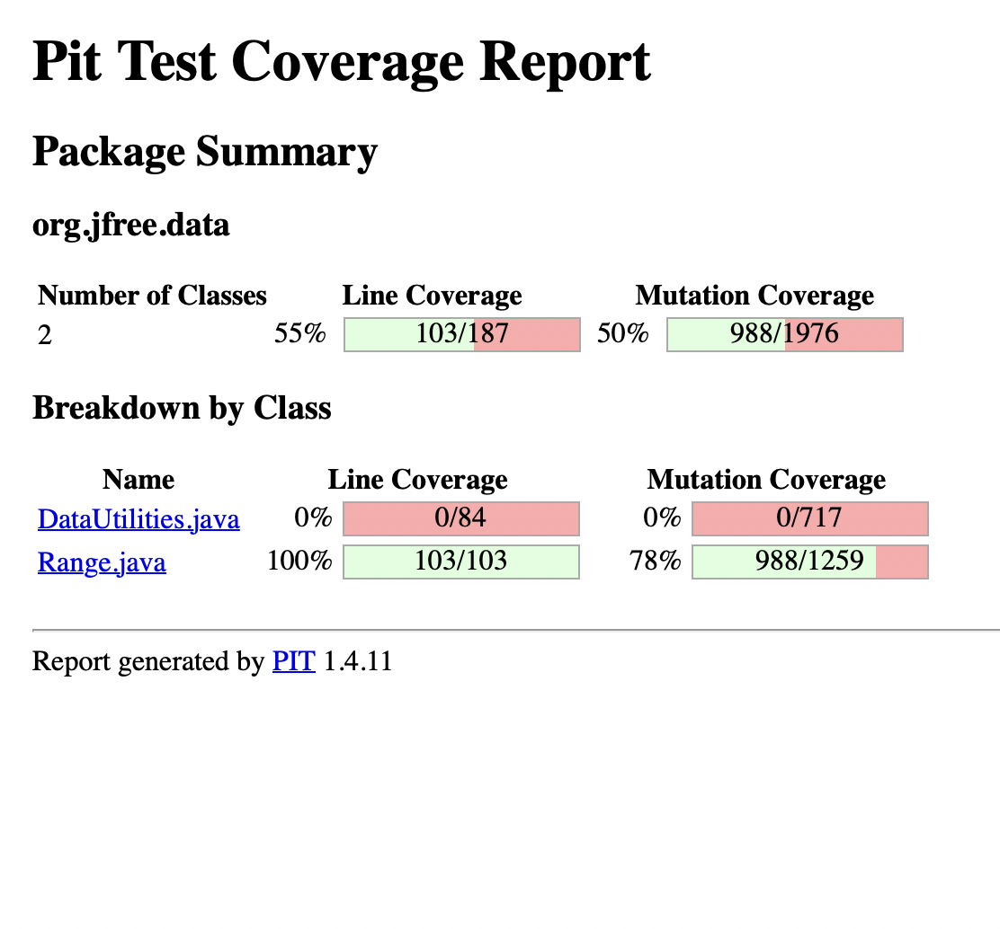

**SENG 438 - Software Testing, Reliability, and Quality**

**Lab. Report \#4 – Mutation Testing and Web app testing**

| Group #21:       |   |
|-----------------|---|
| Student Names:  | Lauraine Baffot  |
|                 | Alexis Hamrak  |
|                 | Abhay Kholsa  |
|                 | Rachel Renegado  |

# Introduction
Mutation testing and using the Selenium tool was the main focus of this lab assignment as to familiarize ourselves with these concepts first seen in the lectures, for the mutation testing our group decided to use the PIT testing tool to see the mutation coverage in Eclipse. In Part 2 of the lab, we used the Selenium IDE extension on our respective browsers. Additionally, mutation testing was introduced to ensure that the original source code has a high error detection, with the test cases written to catch weak spots of the code which were not tested properly. GUI testing was another focal point in this lab assignment, is a bit of an insight to automating the test cases and primarily on the foundation of a user interface which the user can record/run their scripts. 

# Analysis of 10 Mutants of the Range class 
### Range
#### 1. toString()
**Mutation: Replaced return value with “” → SURVIVED**  
**Analysis:** This mutation survived because, with our original test suite, we did not test the method toString() at all which means there was no coverage for the mutations. We added a new test case that gets the string equivalence of a Range object that has a range from 2 to 6 (the result is “Range[2.0,6.0]). This mutation was killed since if we replace the result with “” (an empty string), the *assertEquals* will fail, which is expected.
#### 2. contains(double value)
**Mutation: Changed conditional boundary → SURVIVED**  
**Analysis:** This mutation survived because, with our original test suite, we did not test what happens when the contains(double value) method is called with a parameter that equals the lower or upper bound of the Range object being tested. By adding two additional test cases, where the range is from 2 to 6 and the value is 2 (lower bound case) or 6 (upper bound case), this mutation was killed since the boundaries are being tested.
#### 3. intersects(double b0, double b1)
**Mutation: Changed conditional boundary → SURVIVED**  
**Analysis:** This mutation survived because, with our original test suite, we did not test what happens when the intersects(double b0, double b1) method is called with the parameter b0 equals the upper bound of the Range object being tested or the parameter b1 equals the lower bound of the Range object being tested. To kill this mutation was and test the boundaries, two new test cases had to be created. In the first test case, we create a Range object that has a range from 2 to 6, and the parameter b0 was equal to 6. In the second test case, we create a Range object that has a range from 2 to 6, and the parameter b1 was equal to 2.
#### 4. intersects(Range range)
**Mutation: Replaced boolean return with true → SURVIVED**  
**Analysis:** This mutation survived because, with our original test suite, we did not test what happens when the intersects(Range range) method is called and the result is a false boolean. By adding another test case where the return value for intersects(Range range) is false (the two Range objects do not intersect), we were able to kill this mutation that replaces the boolean, false, with a true boolean because the *assertFalse* will now fail, as it should with a true boolean.
#### 5. shiftWithNoZeroCrossing(double value, double delta)
**Mutation: Replaced double addition with subtraction → SURVIVED**  
**Analysis:** This mutation survived because, with our original test suite, we did not test what happens when the shiftWithNoZeroCrossing(double value, double delta) method when the parameter value is negative. By adding another test case where the parameter value was equal to -1, we were able to enter the else if statement where the statement “value + delta” was changed to (value - delta). This test case killed the above mutation because this will now result in a different value than what was in the *assertEquals*, which is the correct thing to do when the addition is changed to a subtraction.
#### 6. intersects(double b0, double b1) 
**Mutation: Negated conditional → KILLED**  
**Analysis:** For this mutation, the code segment “if (b0 <= this.lower)” is replaced with “if (b0 < this.lower)”. This means that in our test cases when a value of b0 was sent in that was either equal to this.lower, or b0 was less than this.lower, the following lines of the intersects function caused an incorrect value to be returned. 
#### 7. expandToInclude(Range range, double value)
**Mutation: Replaced return value with null → KILLED**  
**Analysis:** This mutation replaced the line: “return new Range(value, value)” with “return null”. The test cases expandToIncludeNullLower and expandToIncludeNullUpper cover this test case because the test cases both expect that the code returns a non-null range that is passed in as the “value” argument. When null is returned by the mutation, the test case fails as it should.
#### 8. expand(Range range, double lowerMargin, double upperMargin)
**Mutation: Replaced double multiplication with division → KILLED**  
**Analysis:** This mutation changes the statement “double lower = range.getLowerBound() - length * lowerMargin” with “double lower = range.getLowerBound() - length / lowerMargin”. This now computes the division of the two terms instead of the multiplication. The test case expandLowerGreaterThanUpper_Lower() killed this mutation because the lower bound is now incorrect. The new range is returned with the incorrect lower bound, and the test case fails.
#### 9. shift(Range base, double delta)
**Mutation: Incremented (++a) double local variable number 1 → KILLED**  
**Analysis:** This mutation replaced the variable “delta” with ++delta. When the test ran with our test cases, for example, with the test case shiftByNegativeDoubleLowerBound, the range should have been shifted -2.2 and instead was shifted by -1.2. The test case expected the range to be shifted to 3.8, and the test case would return a range shifted to 4.8 instead and cause the test to fail, which kills the mutation.
#### 10. scale(Range base, double factor)
**Mutation: Negated double local variable number 1 → KILLED**  
**Analysis:** This mutation replaced the “factor” argument with a value of 1 instead. In our test case scalePositiveRangePositiveFactor, a factor of 2 is sent in as an argument with the range (0,6). When the factor of 1 is used in the computation, an incorrect value is returned and the test case fails, killing the mutation.

# Report all the statistics and the mutation score for each test class
## Original Test Scores
### Range Original Mutation Score (62%)

 
### DataUtilities Original Mutation Score (89%)

 
## Improved statistics
### Range Tests Added 
#### getCentralValuePositive()
- This test was created to test the method getCentralValue() found in the Range class. We create a Range object that has a range from 4 to 8 and used the method to find the central value of this range. We used an *assertEquals* to check if the method is returning the correct number, which should be 6. This method was not tested previously which is why this test was able to kill many mutants and increase the mutation score.
#### containsValueOnLowerBound()
- This test was created to check the lower boundary condition of the contains(double value) method in the Range class. We created a Range object that has a range from 2 to 6 and used the method to check if the value 2 is in this range. We used an *assertTrue* to check if the method is returning a true boolean because the range does contain the value 2 (which is also the lower bound of the range). This test was able to kill many mutants because the lower bound of the range was not being checked beforehand, which also increased the mutation score.
#### containsValueOnUpperBound()
- This test was created to check the upper boundary condition of the contains(double value) method in the Range class. We created a Range object that has a range from 2 to 6 and used the method to check if the value 6 is in this range. We used an *assertTrue* to check if the method is returning a true boolean because the range does contain the value 6 (which is also the upper bound of the range). This test was able to kill many mutants because the upper bound of the range was not being checked beforehand, which also increased the mutation score.
#### containsDecrement()
- This test was created to kill a prefix decremental mutation for the contains(double value) method in the Range class. This test case first creates a range from 5 to 6 and then checks to see if this range contains the value = 5. In this case, the range does contain the value of 5. For this mutant in particular, we wanted to kill a mutant in the line “return (value >= this.lower && value <= this.upper);” which decremented the value to be 4. This mutation would then return false since the range does not contain the value 4, when it should return true since the initial value of 5 was inside the range. Therefore, this mutant was killed.
#### intersectsLowerBoundRangeEqualsUpperBound()
- This test was created to check the upper boundary condition of the intersects(double b0, double b1) method in the Range class. We created a Range object that has a range from 2 to 6 and created a double value lowerBound = 1 and double value upperBound = 2 (which equals the lower bound of the Range object). Using these two double values, we checked if there was an intersection between our Range object and these values. We used an *assertFalse* to check if the method is returning a false boolean because there is no intersection between the Range object and these two values, even though the lower bound of the Range object equals the lowerBound value. This test was able to kill many mutants because the upper bound of the range was not being checked for intersection, which also increased the mutation score.
#### intersectsUpperBoundRangeEqualsLowerBound()
- This test was created to check the lower boundary condition of the intersects(double b0, double b1) method in the Range class. We created a Range object that has a range from 2 to 6 and created a double value lowerBound = 6 (which equals the upper bound of the Range object) and double value upperBound = 7. Using these two double values, we checked if there were an intersection between our Range object and these values. We used an *assertFalse* to check if the method is returning a false boolean because there is no intersection between the Range object and these two values, even though the upper bound of the Range object equals the upperBound value. This test was able to kill many mutants because the boundaries of the range were not being checked for intersection, which also increased the mutation score.
#### intersectsBoundary()
- This test was created to check the lower boundary condition of the intersects(double b0, double b1) method in the Range class. In this test case, we created a Range object with a range from 2 to 3 and created a boolean to store the results of an intersection with b0 = 2 and b1 = 2. After this value was computed, we used the *assertFalse* feature to check if the boolean returned was false because the two points and given range did not intersect. This test killed a mutant that compared the lower value of the range object with b0 because we had not initially tested this lower boundary value.
#### intersectsDecrement()
- This test was created to kill a prefix decremental mutation for the intersects(double b0, double b1) method in the Range class. This test case first creates a range from 2 to 3 and then checks to see  if this range intersects with the points b0 = 2 and b1 = 3. In this case, they do intersect because they are the same range. For this mutant in particular, we wanted to kill a mutant in the line “return (b1 > this.lower);” which decremented b1. This mutation would then make b1 = 2 and return false since b1==this.lower. The test case should return true though, therefore this mutant was killed.
#### intersectsRangeIsFalse()
- This test was created to check the intersects(Range range) method in the Range class. We created a Range object that has a range from 2 to 6 and created another Range object with a range of 7 to 9. We used an *assertFalse* to check if the method is returning a false boolean because there is no intersection between the two Range objects and these two values. This test was able to kill many mutants because we did not previously check for two Range objects that do not intersect, which also increased the mutation score.
#### minAndMaxD2_NaN_LowerBound()
- This test was created to check the min(double d1, double d2) method in the Range class. This test will be testing the min function through the use of the combineIgnoringNaN function. We will be testing the lower bound of the result Range object, which was determined by using this method. We used an *assertEquals* to check if the method is indeed returning the minimum number between 1 and the square root of -1 (NaN). This test was able to kill some additional mutants because we did not previously test the lower bound of the result Range object, which also increased the mutation score.
#### scaleZeroFactor()
- This test was created to check the scale(Range base, double factor) method in the Range class. We created a Range object that has a range from 2 to 6 and called the method with a scaling factor of 0. We used an *assertEquals* to check if the lower bound of the Range object returns the value 0. This test was able to kill some additional mutants because we did not previously test the method when the scaling factor equals zero, which also increased the mutation score.
#### scalePositiveFactor()
-  This test was created to check the scale(Range base, double factor) method in the Range class. We created a Range object that has a range from 2 to 6 and called the method with a scaling factor of 2. We used an *assertEquals* to check if the lower bound of the Range object returns the correct value of 4. This test was able to kill some additional mutants because we did not previously test the method with a positive scaling factor, which also increased the mutation score.
#### shiftWithNoZeroCrossingWhereValueEqualsZero() 
- The test was created to check the shiftWithNoZeroCrossing(double value, double delta) method in the Range class. We created a Range object that has a range from 0 to 0 and called to method shift(Range base, double delta, boolean allowZeroCrossing) which then called the helper method shiftWithNoZeroCrossing(double value, double delta) since the parameter allowZeroCrossing is false. We used an *assertEquals* to check if the upper bound of the Range object returns the correct value after it was shifted by 158. This test was able to kill some additional mutants because we did not previously test the method when the upper bound of the Range object is 0, which also increased the mutation score.
#### shiftWithNoZeroCrossingWhereValueIsNegative()
- The test was created to check the shiftWithNoZeroCrossing(double value, double delta) method in the Range class. We created a Range object that has a range from -2 to -1 and called to method shift(Range base, double delta, boolean allowZeroCrossing) which then called the helper method shiftWithNoZeroCrossing(double value, double delta) since the parameter allowZeroCrossing is false. We used an *assertEquals* to check if the upper bound of the Range object returns the correct value after it was shifted by -158. This test was able to kill some additional mutants because we did not previously test the method when the upper bound of the Range object and the shifting factor are both negative values, which also increased the mutation score.
#### equalsParameterIsNotARangeObject() 
- The test was created to check the equals(Object obj) method in the Range class. We created a Range object that has a range from 2 to 6. We used an *assertFalse* to check if the Range object equals a null object, which it should not. This test was able to kill some additional mutants because we did not previously test the method with a null object, which also increased the mutation score. 
#### equalsDifferentLowerBound()
- The test was created to check the equals(Object obj) method in the Range class. We created a Range object that has a range from 2 to 6. We used an *assertFalse* to check if the Range object equals another Range object that has a range from 3 to 6, which it should not since the lower bounds for both Range objects are different. This test was able to kill some additional mutants because we did not previously test the method with two Range objects where the lower bounds are different, which also increased the mutation score. 
#### equalsDifferentUpperBound() 
- The test was created to check the equals(Object obj) method in the Range class. We created a Range object that has a range from 2 to 6. We used an *assertFalse* to check if the Range object equals another Range object that has a range from 2 to 5, which it should not since the upper bounds for both Range objects are different. This test was able to kill some additional mutants because we did not previously test the method with two Range objects where the upper bounds are different, which also increased the mutation score. 
#### hashCodeTest()
- The test was created to check the hashCode() method in the Range class. We created a Range object that has a range from 2 to 6. We used an *assertEquals* to check if the Range object’s hashcode is correct. This test was able to kill some additional mutants because we did not previously test the hashCode() method at all, which means there was no coverage for this method and increased the mutation score. 
#### toStringTest()
- The test was created to check the toString() method in the Range class. We created a Range object that has a range from 2 to 6. We used an *assertEquals* to check if the string returned is “Range[2.0,6.0]”. This test was able to kill some additional mutants because we did not previously test the toString() method at all, which means there was no coverage for this method and increased the mutation score.
#### constrainDecrement()
- This test was created to kill a prefix decremental mutation for the constrain(double value) method in the Range class. This test case first creates a range from 1 to 4 and then finds the closest value to 1. In this case, 1 should be returned. For this mutant in particular, the local variable result takes on this value of 1 and is decremented to be 0. The value remains equal to 1 and so the value of 0 is returned. This mutation would then fail the *assertEqual* to 1 because 0 != 1 and therefore this mutant was killed.

### DataUtilities Tests Added
#### calculateColumnTotalRowGreaterRowTotal()
- This test created in our lab assignment four was to mainly check on the boundary condition of the DataUtilities.java in which the method calculateColumnTotal has the condition of row < rowCount in which it requires a rowCount greater than the valid rows which are being passed into the method. In the previous lab, we did not account for this case hence this new test case is specifically aimed at adding to our overall mutation coverage results for this class. The test case delivers this by having row being greater with a value of 4 and the rowCount only being 1 this is done with the help of using Mocking framework JMock in which this mock object is created with the specific properties.  
#### calculateColumnTotalRowEqualRowTotal()
- This mutant survived our original source code hence we were able to kill this mutant with our test case which again builds on the foundation of the JMock and created a mock object instead this time we were testing for the boundary condition of making the row and rowCount equal to each other which the method does not account for and the running total of the column becomes zero since this condition does not have a specific path to be taken. This conditional checking of this equality ensured that this mutant was killed by our test case generated.  
#### calculateColumnTotalNEqualNull() 
- For this test case we were testing a different part of the method which was using JMock framework and using a mock object with the statement of if n != null this mutant had survived in our original test suite which did not account for this, hence prompting us to create a test for increasing our overall mutation coverage. This test passed a null value as n which made that row disregard this value when calculating the total sum of the values in that column which is specified. 
#### calculateRowTotalChangedConditional()
- To kill the mutation on line 164 of DataUtilities.java titled “changed conditional boundary,” that had survived the original test suite, we developed this test to test the boundary for the condition “if (col < colCount)”. To do this, we created a mock object of Values2D with the value 1 returning when getColumnCount() is called. We passed the value 1 to the validRows parameter. In the calculateRowTotal function, colCount and col both gets the value 1 - covering the boundary condition and thus killing the mutant. 

# Analysis drawn on the effectiveness of each of the test classes
After adding the additional test cases to each test class (detailed in the above section), the effectiveness of each class was improved as follows:

### Range Class
#### Range New Mutation Score With Tests (78%)

Comparing our mutation scores from the original test set (from Assignment 3) to our updated mutation scores (with our new test cases), we can see an increase of 16% - exceeding the required 10% increase as described in the lab manual. At a mutation test score of 78%, our test set is acceptable to clarify the reliability of the software program, but there is still room for improvement. There are a total of 271 mutants that survived.

 
### DataUtilities Class
#### DataUtilities New Mutation Score With Tests (92%)

*Note: We could 10% increase in mutation score for DataUtilities because we already had 89% with the original test suite. As we began to kill off mutations, the mutations we needed to kill became harder to catch and kill.* Comparing our mutation scores from the original test set (from Assignment 3) to our updated mutation scores (with our new test cases), we can see an increase of 3%. While not accomplishing the 10% increase, our test set has an acceptable mutant score - deeming our test set to be successful in detecting software faults and therefore a strong test set. There are a total of 271 mutants that survived.
 
# A discussion on the effect of equivalent mutants on mutation score accuracy
As we learned in class, a mutant is said to be killed when it produces different outputs while running the same test case as the original program; otherwise, it has survived. The mutant score accuracy represents the fault revealing power - the higher the number of killed mutants, the higher is the test case power. In mutation testing, a phenomenon that has caused issues in mutation testing is caused by equivalent mutants. Since equivalent mutants have the same behavior as the original program, the test set does not actually kill the mutant. Due to this, the mutation score accuracy is inaccurate to the actual representation mutant score (representation of the total killed mutants over the total mutations). 

# A discussion of what could have been done to improve the mutation score of the test suites 
The mutation coverage score is based on whether the mutants survive or are killed by the tests we had created in the earlier labs. For the DataUtilties.java our mutation score was already at a near-perfect 100% hence there are not many changes to be made to improve the test cases but as a general idea, the goal was to test the boundary conditions which were missed by our original test suite creation. For Range.java since it was a bigger file, it had more mutants. To improve the score of this, we had created additional tests to kill different types of mutants, such as boundary conditions or increment and decrement operators. To improve these suites and kill many mutants, the conditional statements were focused on since these were areas where many mutants were produced. Overall the main idea used by the group was to use these statement checks together to have a greater chance in increasing the PIT mutation coverage score in the summary section. 

# Why do we need mutation testing? Advantages and disadvantages of mutation testing 
Mutation testing is essential in the Software Development life cycle as it provides in the testing phase an additional verification of the test suite which we have created, it could potentially lead us to create additional rests which may have been left out with bugs that we could not have thought of when generating unit tests. The mutants which are in our code check if the test suite can kill the different conditions, variable values in the statements leading to a more robust test suite for our source code. With each testing coverage tool learnt in the course thus far, each possesses its own advantage and disadvantage which will be explored. Some benefits of using mutation testing are that the test cases are being thoroughly verified and validated with the different bugs being injected into our source code. It creates unique test cases with the overall testing suite to become comprehensive in detecting the faults in the classes. Some of the drawbacks that this method of testing introduces is that you cannot guarantee that the mutant will be resolved in every situation in the source code as it does not check the logic implementation of the source code instead it is more for verifying the conditionals. For larger source codes that are being tested, there will be a huge amount of mutants which can result in creating confusion for the test developer to understand the purpose of the mutants in the code. The final reason is that the mutation testing is time heavy on analyzing the mutants which have been survived and potentially be costly for the company which is tight on the budget depending on the requirement outlined for the project.

# Explain your SELENIUM test case design process
When designing our Selenium test cases, we first explored the website to understand all the different functionalities that we could test. We made a list of these functions, which included logging into the system, adding an item to the cart, searching for an item and one that doesn’t exist, etc., and then executed each function with some test inputs. Once we were familiar with the site and its workings, we started writing the test cases into Selenium one by one. We ended up having 12 cases to test the functionality of the system, some of which had multiple tests such as logging in with a valid username and invalid username, as well as some standalone test cases such as testing a gift card code with an invalid code. We wanted to test all the major system functionalities and those that required typing into various fields instead of ones that just involved redirections within the site. This way we could ensure that the website was redirecting correctly, and also using the data being input correctly. 

# Explain the use of assertions and checkpoints
Assertions and checkpoints (or validations) are used by Selenium to ensure that the system behaves as expected. This is done automatically by the application, which makes them straightforward to use. Selenium places these validations after any form of user input occurs such as a mouse click, scroll, or text is inputted. When running the test case, if one of the inputs is unexpected or incorrect, the case will stop and fail at that checkpoint. This works similar to the JUnit testing, which will return a failure if the assertion fails. 

# How did you test each functionality with different test data
When running the test cases, we were able to change the “Value” field in Selenium after the test case was finished recording. This allowed us to test different data and ensure the test behaved as expected. If we had recorded additional input to the test case after the input was used, for example, if we used the store selector to search for stores in Calgary, and then selected one of the stores, the test case would fail if we changed the input to Edmonton because the redirection to the Calgary store is not accessible from the Edmonton store locator. There were some test cases that we decided to create multiple test cases for, such as logging in with a correct and incorrect username because each feature ended in different outputs and we wanted to store both outputs as tests. 

# Discuss advantages and disadvantages of Selenium vs. Sikulix
Selenium uses locators based on HTML code to store the user’s input to the UI. This means that every click, scroll, mouse position, etc. is stored by the program. In contrast, Sikulix uses image recognition to store user decisions. Both formats could be beneficial depending on the UI being tested. Ones with many different buttons and images would be better to use Sikulix with and ones with lots of redirection and positioning may be preferred to use Selenium with. An advantage to both tools is that test case execution can be automated, meaning that the user can record the test once and not have to perform the same actions over again. 
A disadvantage to Sikulix is that any images saved may match multiple elements on the interface. This may cause problems when re-running the tests. In a similar way, with Selenium, when a test is executed but something unexpected happens the test fails. For example, when we were writing test cases that involved logging in, we had to ensure that we logged back out before running the next test or the test would be confused and break. Another disadvantage to Selenium is that it only works on web-based applications. Sikulix on the other hand, can be used for different GUI applications since it is image based. 

# How the teamwork/effort was divided and managed
Our team started by working on the Selenium tests. We each investigated the BestBuy website individually and determined 2 functionalities that we could test. A few of these tests had to be chained together, for example, logging in and selecting an item to purchase, adding it to our cart and checking out, and finally logging out of the account. Once we had determined our test cases, we used Alexis’ computer to create a test suite and write each of our test cases on. After each test case was written, the member who came up with the test would watch the test run to ensure that it performed as expected. Once all the test cases were written and executed, the whole test suite was executed to see how it would run as a whole. 
 
We then moved over to the mutation testing and spent some time investigating and running the DataUtilities and Range test classes through PiTest. Once we understood how the software worked, we split into pairs to investigate the mutations and determine how to improve the mutation coverage scores. Both pairs, consisting of Abhay and Rachel, and Lauraine and Alexis, used pair programming to write all the mutation tests. One member programmed the tests while the other assisted and helped them come up with the logic needed to perform the test, and then the pairs switched roles. Once all the mutations were written, we ran both programs to ensure that the mutation coverage scores had improved by 10% in the case of Range, and reached 99% in the case of DataUtilities. 

# Difficulties encountered, challenges overcome, and lessons learned
Our team found it quite difficult to learn how to use PiTest. There was no documentation provided, and the lab document was not clear on how the tests for each class should have been divided and run. We initially experienced many issues running PiTest and were instructed to move onto the Selenium section instead. We were under the impression that the TAs would reach out to us and explain how to fix the issues we were facing, but we had not received any emails and had to ask others in the class whose software worked to help us run the code without failure. The main challenge was that we could not run the test class if any tests failed, and we had to fix these issues before attempting to run the mutation coverage. Another challenge that we faced was that PiTest took a long time to run on some group members’ machines and not as long on others. This made re-running the mutations a lengthy process and forced us to program on Rachel and Lauraine’s computers since theirs ran faster and did not have any issues. Another challenge we faced was with Selenium and determining how the validation was executed. We initially didn’t know that it was done automatically but once we understood how it worked, we were able to use the software without any issues. 

# Comments/feedback on the lab itself
This lab was quite time-consuming, as it was not obvious how to use both Selenium and PiTest. Some more in-depth instructions about knowing which errors to ignore and how to interpret the results of PiTest would have been quite helpful. For Selenium, it would have been helpful to see an example of the validation performed by the software when running a test case. We would have saved quite a bit of time if this had been provided to us. Overall, our group enjoyed using Selenium more than PiTest because it was more user-friendly and easier to understand. We could also run the tests much faster on Selenium and didn’t waste any time waiting for a report to compile, unlike PiTest. Now that we understand how to use both tools, we can see ourselves using the software for future projects. PiTest would be helpful to ensure that a class is being fully tested, and Selenium would be useful for GUI testing.
